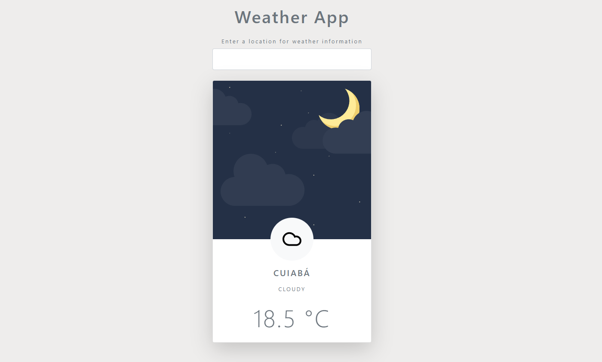

<h1 align="center">Weather app</h1>

<h1 align="center">
    
</h1>

<h2 align="center">Live Demo: https://sirfaria.github.io/WeatherApp/</h2>

## 💻 Project

An app to check the weather and temperature of the chosen location.

Created using AccuWeather api.

## 🚀 Techs

This project was built with:

- HTML
- CSS
- JavaScript

